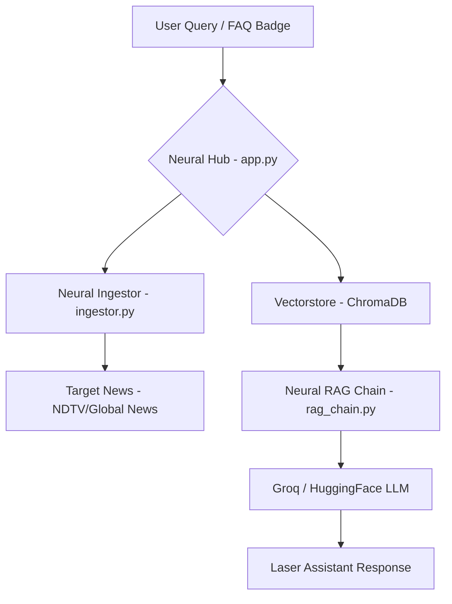

# 🤖 Neural News AI: RAG Intelligence System

<div align="center">
  
  
  
</div>

---

## 🌌 Overview
**Neural News AI** is a premium Retrieval-Augmented Generation (RAG) assistant designed to ingest, process, and analyze real-time news data with tactical precision. Featuring a high-tech **Laser AI** interface, it provides a seamless bridge between raw information and actionable intelligence.

### ✨ Premium Neural Features
- **🎯 Laser AI Interface**: Glassmorphism UI with animated laser grids, shooting beams, and glowing scan-lines.
- **⚡ Quick Action FAQs**: Instant news summaries and "Top 10 Headlines" at the click of a button.
- **🕵️ Robust News Ingestion**: Advanced scraper optimized for NDTV and other restricted news hubs using browser-mimicking sessions.
- **🧬 Hybrid RAG Architecture**: Powered by Groq/HuggingFace LLMs and ChromaDB vector search for pinpoint accuracy.

---

## 🧬 System Architecture



---

## 🛠️ Neural Tech Stack
- **Engine**: [LangChain](https://www.langchain.com/)
- **Intelligence**: [Groq API](https://groq.com/) (LLaMA-3)
- **Vector Core**: [ChromaDB](https://www.trychroma.com/)
- **Extraction**: [BeautifulSoup4](https://www.crummy.com/software/BeautifulSoup/bs4/doc/) & [Requests Sessions](https://requests.readthedocs.io/)
- **Interface**: [Streamlit](https://streamlit.io/) with Custom Vanilla CSS

---

## 🚀 Neural Uplink (Setup)

### 1. Requirements
Ensure you have Python 3.10+ installed.

### 2. Configuration
Create a `.env` file in the root directory:
```env
GROQ_API_KEY=your_groq_api_key_here
HF_TOKEN=your_huggingface_token_here
```

### 3. Installation
```bash
pip install -r requirements.txt
```

### 4. Activation
```bash
streamlit run app.py
```

---

## 📁 Neural Project Registry
- `app.py`: The central Neural Hub (UI/UX).
- `ingestor.py`: The information extraction system.
- `vectorstore.py`: The neural memory management.
- `rag_chain.py`: The core RAG intelligence logic.
- `llm.py`: The LLM integration bridge.
- `background.jpg`: The neural companion background image.

---

## 🏆 Credits
**Architect**: Rishi Jain  
**System**: Neural News Intelligence Framework  

---

<div align="center">
  <p><i>Powering the future of news analysis with tactical AI.</i></p>
  
</div>